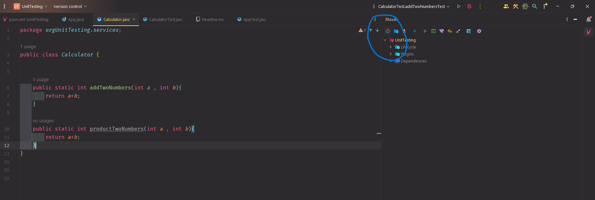

<div align = "center">

# 🧐 Checkout Project Code 🧐

*------ **🧠 Java Unit Testing : JUnit  🧠** ------*

## 🌲 Step - 1 : Install JUnit Testing

#### ✍️ Follow Every Video Instruction :  **([👉Click Here](https://youtu.be/sq_pYMepfP0?si=ZNP9loi9CNaiAtvO))**


#### ✍️ How to Create And Use Unit Tests in JUnit :  **([👉Click Here](https://youtu.be/vZm0lHciFsQ?si=YN50wEfrrpJrzAo7))**

#### ✍️ A Complete Playlist if you want to learn more JUnit :  **([👉Click Here](https://youtube.com/playlist?list=PLt4nG7RVVk1iGkgOCXmG8Cs8Pjw1Hj6Y6&si=4bWOz2CUJccUaAW9))**

<hr>

*------ **🎥 Video Resources : Careful Do Steps of Installing Junit 🎥** ------*

##### ✍️ JUnit 4 Download Link :  **([👉Click Here](https://mvnrepository.com/artifact/junit/junit/4.12))**

```agsl
<dependency>
    <groupId>junit</groupId>
    <artifactId>junit</artifactId>
    <version>4.12</version>
    <scope>test</scope>
</dependency>
```


##### ✍️ Must Refresh The Maven after Changing New Dependency



<hr>

</div>


<div align = "center">

*------ **🧠 Java Unit Testing : Mockito   🧠** ------*

## 🌲 Step - 1 : Install Mockito Testing

#### ✍️ Follow Every Video Instruction :  **([👉Click Here](https://youtu.be/aNCPy803rkI?si=vrzZ2F7CjKypoJZ4))**


#### ✍️ Project Code of Video :  **([👉Click Here](https://github.com/TshRahul/mockito-intro/blob/master/src/main/java/Student.java))**

<hr>

*------ **🎥 Video Resources : Careful Do Steps of Installing Mockito 🎥** ------*

##### ✍️ Mockito Download Link :  **([👉Click Here](https://mvnrepository.com/artifact/org.mockito/mockito-core/5.6.0))**

```agsl
 <dependency>
      <groupId>org.mockito</groupId>
      <artifactId>mockito-core</artifactId>
      <version>3.5.2</version>
      <scope>test</scope>
    </dependency>
```


##### ✍️ Must Refresh The Maven after Changing New Dependency

<hr>

</div>

<div align = "center">

*------ **🧠 Java UI Testing : Selenium Web Driver 🧠** ------*

## 🌲 Step - 1 : Install Selenium Web Driver

#### ✍️ Follow Every Video Instruction :  **([👉Click Here](https://youtu.be/dbzc9UbFZt8?si=pMu5CqxxiZfIcuvv))**

#### ✍️ Selenium Documentation :  **([👉Click Here](https://github.com/Sumonta056/UI-and-Unit-Testing-in-Java/blob/main/Selenium%20Driver/Selenium%20Concepts.pdf))**

<hr>

*------ **🎥 Video Resources : Careful Do Steps of Installing Selenium Web Driver 🎥** ------*

##### ✍️ Selenium Web Driver Download Link :  **([👉Click Here](https://mvnrepository.com/artifact/org.seleniumhq.selenium/selenium-java/4.16.1))**
##### ✍️ Edge Web Driver :  **([👉Click Here](https://developer.microsoft.com/en-us/microsoft-edge/tools/webdriver/?form=MA13LH#downloads))**


```agsl
<!-- https://mvnrepository.com/artifact/org.seleniumhq.selenium/selenium-java -->
<dependency>
    <groupId>org.seleniumhq.selenium</groupId>
    <artifactId>selenium-java</artifactId>
    <version>4.16.1</version>
</dependency>

```


##### ✍️ Must Refresh The Maven after Changing New Dependency


<hr>

</div>
